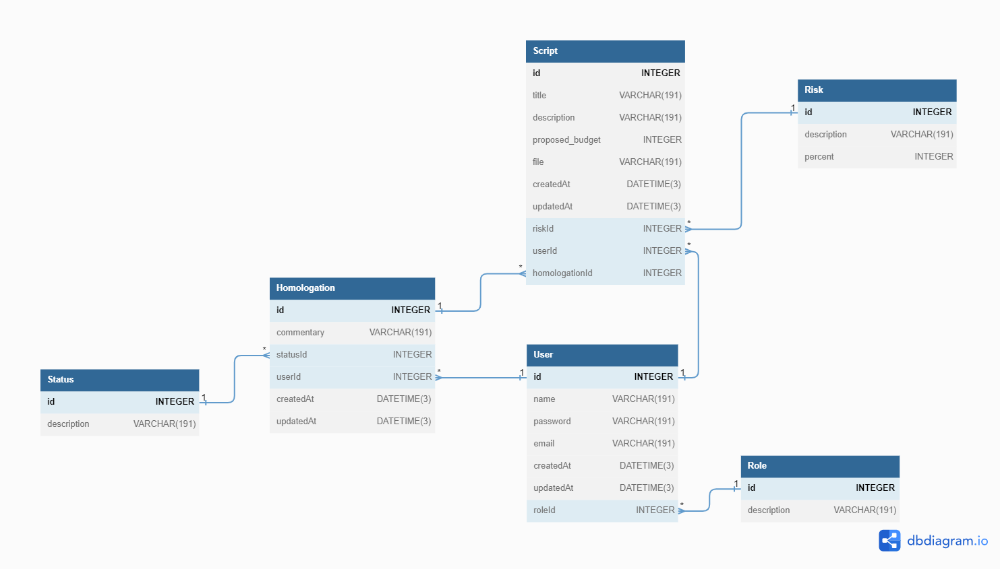

## Running the app

```bash
# install all dependencies
$ npm i

# generate prisma
$ npx prisma generate

# seeds
$ npx prisma db seed

# development
$ npm run start

# watch mode
$ npm run start:dev

# production mode
$ npm run start:prod
```
